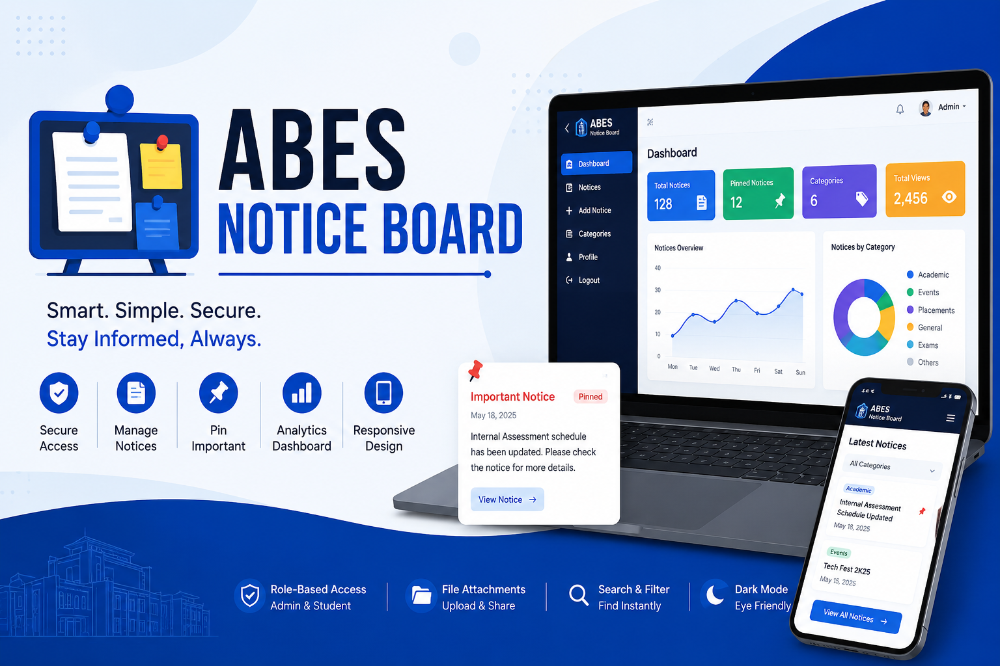
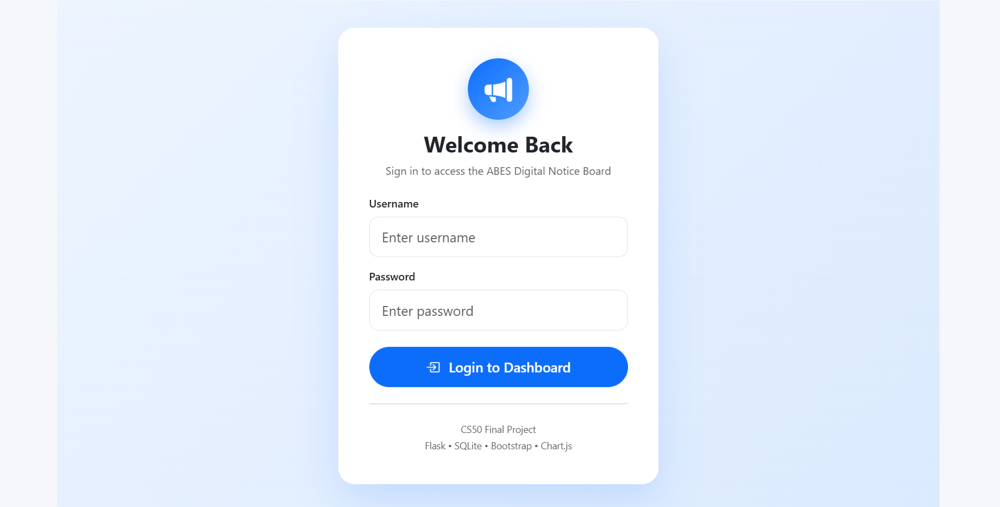
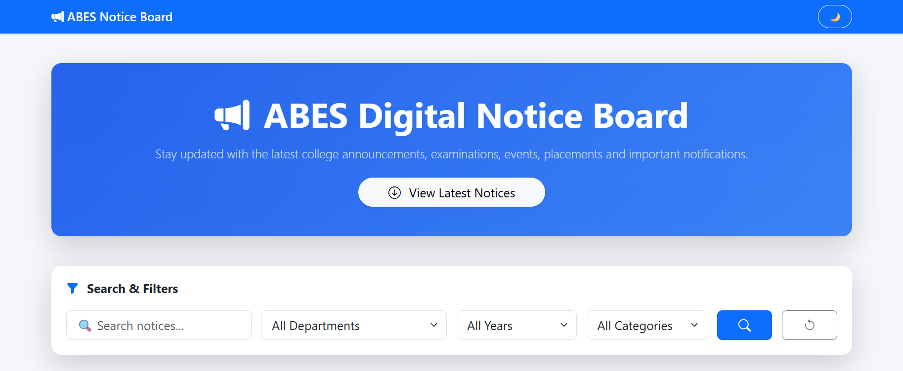
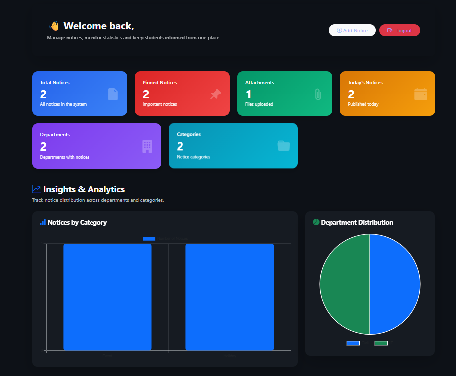
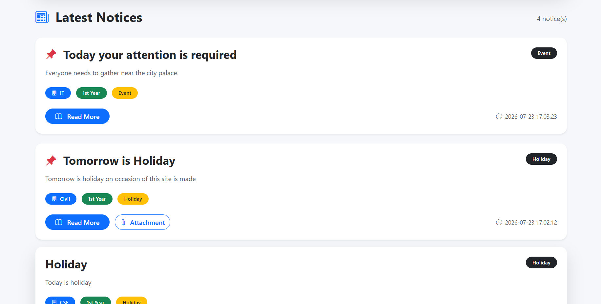

# ABES Digital Notice Board

#### Video Demo: https://youtu.be/D7qDoX8pBQk

#### Description:

<p align="center">
  
</p>

<p align="center">
  <strong>A modern digital notice board system built with Flask, SQLite, Bootstrap, and Chart.js.</strong>
</p>

<p align="center">


</p>

---

## 📖 About

**ABES Digital Notice Board** is a modern web application developed using **Flask** that digitizes the traditional college notice board system.

Instead of relying on physical notice boards, administrators can publish notices online while students can access them anytime through a clean and responsive interface.

This project was developed as my **CS50 Final Project**.

---

# ✨ Features

### 👨‍💼 Admin

- Secure Login
- Create Notices
- Edit Notices
- Delete Notices
- Pin / Unpin Important Notices
- Upload Attachments
- Dashboard Analytics
- View Statistics
- Category Management

### 👨‍🎓 Student

- Browse Notices
- Search Notices
- Filter by Department
- Filter by Year
- Filter by Category
- View Notice Details
- Responsive Mobile Experience

### 🎨 User Interface

- Responsive Design
- Bootstrap 5
- Dark Mode
- Toast Notifications
- Delete Confirmation Modal
- Count-up Dashboard Animation
- Smooth Page Animations

---

# 🛠️ Built With

- Python
- Flask
- CS50 SQL
- SQLite
- HTML5
- CSS3
- Bootstrap 5
- JavaScript
- Jinja2
- Chart.js

---

# 📸 Screenshots

## Login



---

## Home



---

## Dashboard



---

## Notice Details



---

# 📂 Project Structure

```text
ABES-Notice-Board
│
├── assets/
├── database/
│   ├── schema.sql
│   └── notice.db
│
├── static/
│   ├── css/
│   ├── js/
│   └── screenshots/
│
├── templates/
│
├── app.py
├── helpers.py
├── config.py
├── init_db.py
├── requirements.txt
├── README.md
└── LICENSE
```

---

# ⚙️ Installation

## Clone Repository

```bash
git clone https://github.com/MFazal231/ABES-Notice-Board.git
```

```bash
cd ABES-Notice-Board
```

---

## Create Virtual Environment

```bash
python -m venv .venv
```

Windows

```bash
.venv\Scripts\activate
```

Linux / macOS

```bash
source .venv/bin/activate
```

---

## Install Requirements

```bash
pip install -r requirements.txt
```

---

## Initialize Database

```bash
python init_db.py
```

---

## Run

```bash
flask run
```

---

# 🔐 Default Admin Credentials

| Username | Password |
|-----------|----------|
| admin | admin123 |

> **Note:** Change the default password before deploying the application in a production environment.

---

# 📊 Dashboard

The administrator dashboard provides:

- Total Notices
- Department-wise Distribution
- Category Statistics
- Interactive Charts
- Recent Activity

---

# 🔎 Search & Filters

Students can easily search notices using:

- Keywords
- Department
- Academic Year
- Category

making it easier to locate important announcements.

---

# 🔒 Authentication

The application uses:

- Password Hashing
- Session Authentication
- Role-Based Authorization
- Protected Routes
- Admin Middleware

---

# 📱 Responsive Design

The website works across:

- 💻 Desktop
- 📱 Mobile
- 📱 Tablet

using Bootstrap 5.

---

# 🚀 Future Improvements

- Email Notifications
- Push Notifications
- Multiple Admin Roles
- Notice Scheduling
- Student Profiles
- PDF Preview
- Image Attachments
- REST API
- Docker Deployment
- Cloud Database Support

---

# 👨‍💻 Author

**Mohammad Fazal**

- GitHub: https://github.com/MFazal231

---

# 📄 License

This project is licensed under the MIT License.

See the **LICENSE** file for details.

---

## ⭐ Support

If you found this project helpful, consider giving it a ⭐ on GitHub.